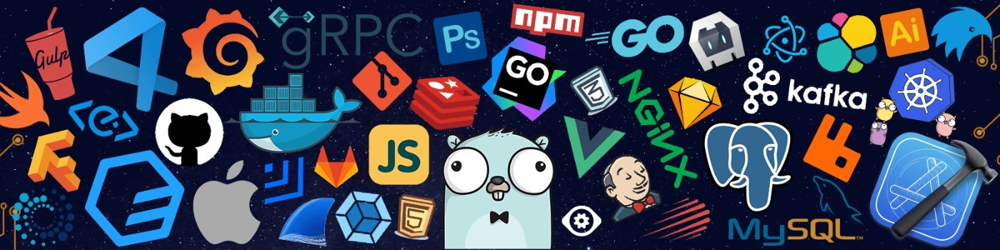

## 🌐 Socials:
[](https://facebook.com/0x52414e53) [](https://instagram.com/_its.ransss) [](https://linkedin.com/in/https://www.linkedin.com/in/rany-boy-templado-a14808242/) 

<div align="center">
     
</div>


```java
    public class Introduction {

    String name;
    String role;
    String passion;
    String[] languageSpoken;
    String location;
    String[] languages;
    String[] tools;

    public Introduction() {
        this.name = "Ranney Templado";
        this.role = "Student";
        this.passion = "Aspiring Software Engineer";
        this.languageSpoken = new String[]{"English", "Filipino", "Cebuano"};
        this.location = "Philippines";
        this.languages = new String[]{"C++", "Java", "HTML", "CSS", "JavaScript", "VB.Net", "MySQL", "MariaDB"};
        this.tools = new String[]{"Bootstrap", "Git", "Figma"};
    }

    public void quote() {
        System.out.println("When thoughts of quitting arise, recall the purpose that ignited your journey.");
    }

    public static void main(String[] args) {
        Introduction me = new Introduction();
        me.quote();
    }
}
```
<h3 align="left">Languages and Tools Already Used:</h3>
<p align="left"> <a href="https://www.w3schools.com/cpp/" target="_blank" rel="noreferrer">  </a> <a href="https://www.w3.org/html/" target="_blank" rel="noreferrer">  </a> <a href="https://www.w3schools.com/css/" target="_blank" rel="noreferrer">  </a> <a href="https://getbootstrap.com" target="_blank" rel="noreferrer">  </a> <a href="https://www.java.com" target="_blank" rel="noreferrer">  </a>      <a href="https://dotnet.microsoft.com/" target="_blank" rel="noreferrer">  </a>  <a href="https://git-scm.com/" target="_blank" rel="noreferrer">  </a>  <a href="https://developer.mozilla.org/en-US/docs/Web/JavaScript" target="_blank" rel="noreferrer">  </a> <a href="https://mariadb.org/" target="_blank" rel="noreferrer">  </a> <a href="https://www.mysql.com/" target="_blank" rel="noreferrer">  </a> <a href="https://www.figma.com/" target="_blank" rel="noreferrer">  </a> </p>


# 📊 GitHub Stats:


<div align="center">
  
</div>

<div align="center">
  
  
</div>

<div align="center">
  
  
</div>

<div align="center">


</div>

### ✍️ Random Dev Quote


### 😂 Random Dev Meme


## 💰 You can help me by Donating
[](https://paypal.me/paypal.me/ranney20) 

---
[](https://visitcount.itsvg.in)
